<h1>Test Assignment Clear Solutions</h1>

<ol>
<li> 
<h3>Clone and run project</h3>

```cmd
git clone https://github.com/FilosofDanil/testAssignmentClearSolutions.git
```

After that open the project in the convenient IDE and run the main class.
After application will be up and running, you will be able to test it.

</li>
<li> 
<h3>
    Testing of test assignment(examples)
</h3>

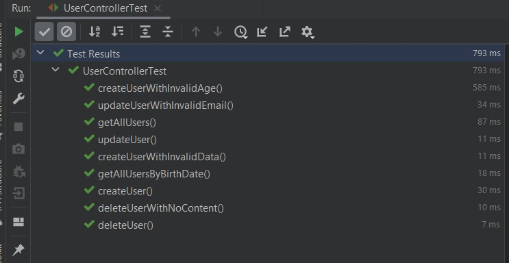
Run tests for controller

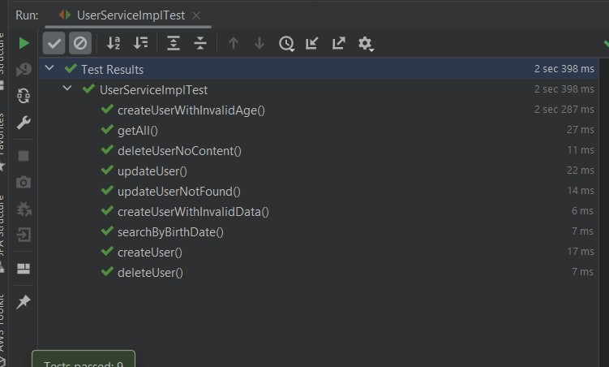
Run tests for service 

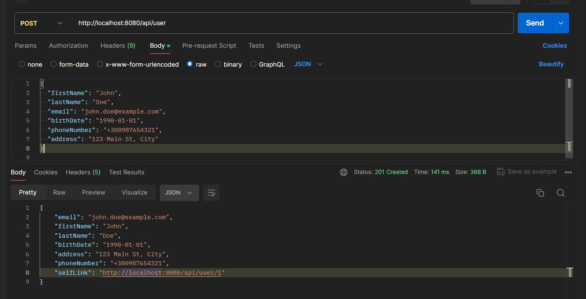
Creating(register) user, using POST request to our api

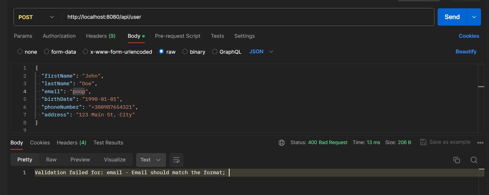
Validation error, while trying to create user with invalid email

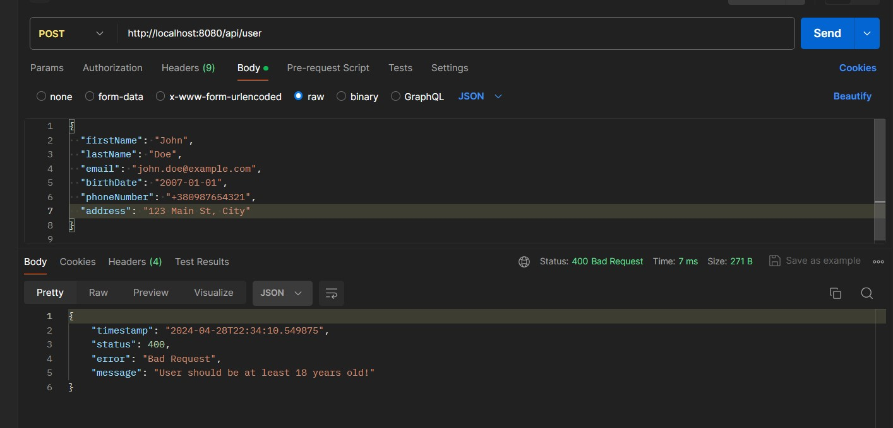
Validation error, while trying to create user, which is under 18 years old
(This age may be changed in the configuration file)
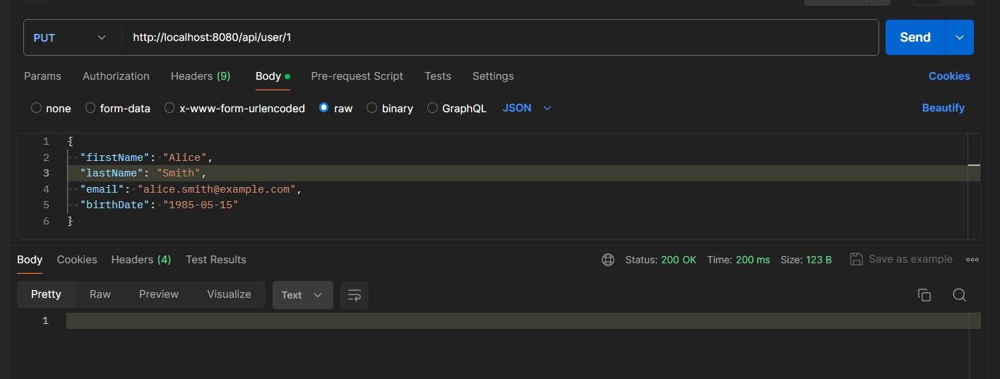
Successfully updated user, using self-link, provided after creation. Here updated main fields, but you also able to change only one, or all of them.
Validation works as well as in creation.
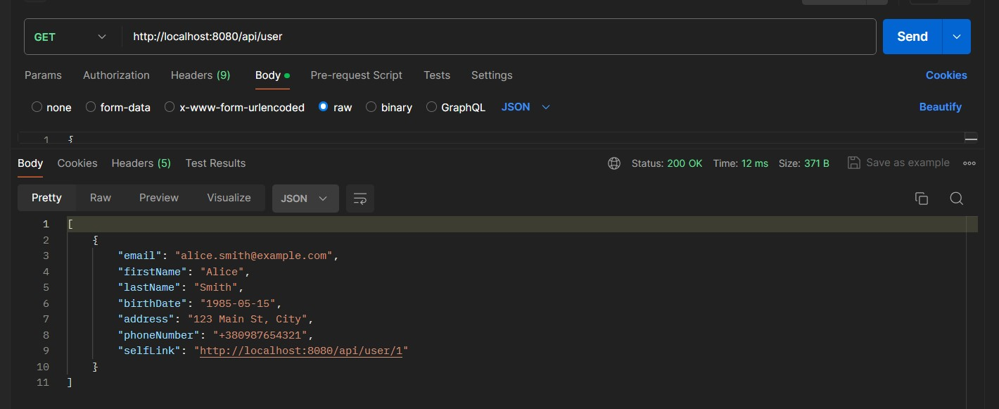
After update we should check our user and notice, that all is up to date and data has successfully changed  

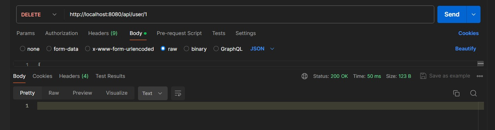
Successfully deleted our user.
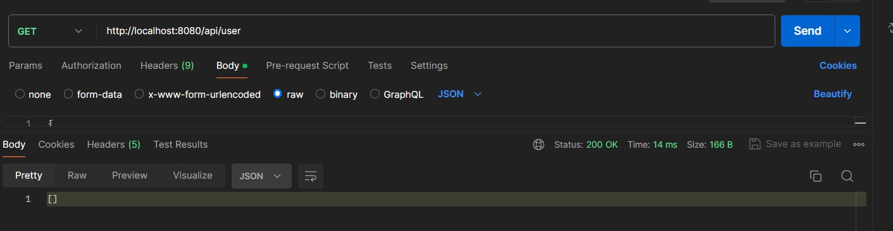
After deletion we should check it and notice that no user present in the database, and that means that it has been successfully deleted.

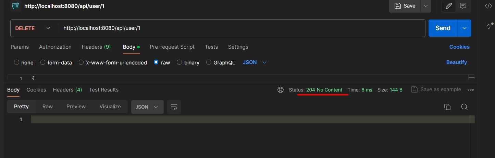
After all, any attempts to delete content which didn't exist will return 204 No Content status

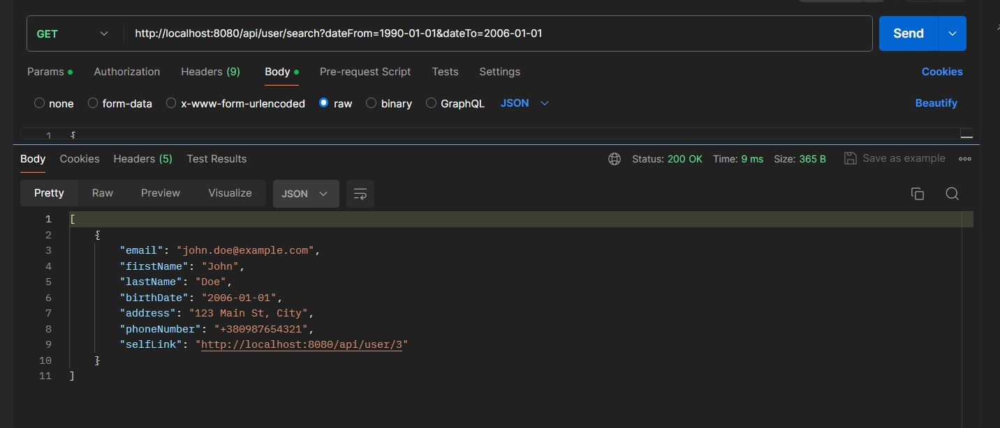
Lastly, I have tested endpoint for searching by date, and it works properly

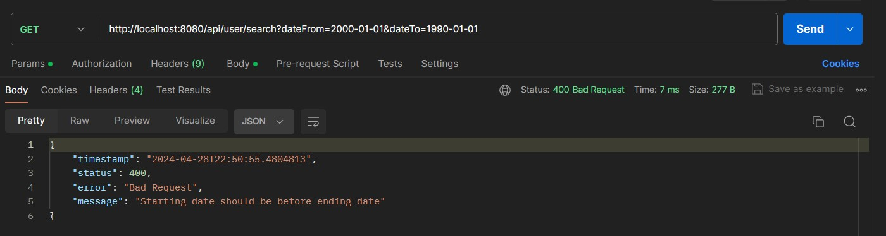
If user tries to request with invalid parameters(dateFrom is after dateTo)
So it returns Bad Request

</li>

<li>
    Here are also some JSON if needed, when you need to test my api by yourself:

```json
{
  "firstName": "John",
  "lastName": "Doe",
  "email": "john.doe@example.com",
  "birthDate": "1990-01-01",
  "phoneNumber": "+380987654321",
  "address": "123 Main St, City"
}

```

```json
{
  "firstName": "Bob",
  "lastName": "Johnson",
  "email": "bob.johnson@example.com",
  "birthDate": "1983-10-20",
  "phoneNumber": "+380987654321"
}

```

```json
{
  "firstName": "Emma",
  "lastName": "Brown",
  "email": "emma.brown@example.com",
  "birthDate": "1992-08-30"
}

```
</li>

<li>
    <h3>Conclusion</h3>
All requirements are satisfied: 
Created REST api, which covered by unit tests. Our API is able to register users and it has proper validation. Also our REST API is able to update one/some/all fields using just one endpoint. Lastly, all exceptions and errors are handled, logged,  and user gets it in convenient format. 
</li>

<li>
 <h3>
    Thank you for considering my application!
</h3>
</li>

</ol>